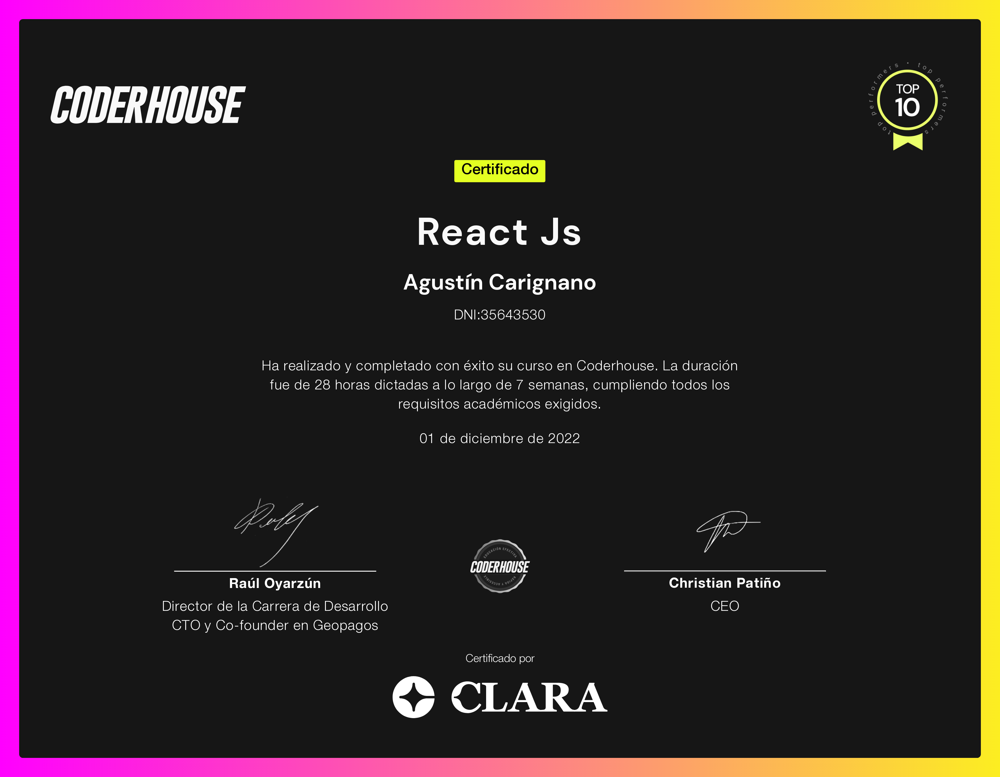

<h1 align="center"> Tyrion Drink Shop - React Project </h1>

Tyrion es un E-commerce de bebidas alcohólicas, creado como proyecto final para el curso de React JS, impartido por Coderhause.

## Breve descripción.

La aplicación consta de un contenedor principal con todos los productos disponibles en la tienda. A partir de las cards de cada item, es posible acceder a una descripción detallada del mismo, y añadir productos a un carrito de compras.

Desde el menú de navegación se pueden seleccionar diferentes categorías de bebidas, o realizar un búsqueda por nombre de un producto.

Desde el carrito de compras, el usuario tiene la posibilidad de agregar o quitar items, y enviar una orden de compra luego de rellenar un breve formulario con sus datos personales.

## Características del proyecto

- Este proyecto fue iniciado con [Create React App](https://github.com/facebook/create-react-app).

- Para la navegabilidad de la página, se utlizó [React-router-dom](https://reactrouter.com/en/main)

- Para la base se datos, se utilizó el servicio de [Firebase](https://firebase.google.com/).

## Deploy del proyecto

Para visualizar la aplicación, haz click en el siguiente enlace: [Tyrion - Drink Shop](https://proyecto-react-carignano.vercel.app/)

# Instalación

### Descargue una copia del repositorio:

    git clone https://github.com/AgustinCarignano/ProyectoReact-Carignano.git

### Instale las dependencias necesarias para poder ejecutar la aplicación:

    npm install

### Corra la aplicación en modo desarrollo:

    npm start

La página se recargará automáticamente cuando se realicen cambios.

Sí el navegador no se abre automáticamente, puede visualizar la aplicación haciendo click en el enlace: [http://localhost:3000](http://localhost:3000)

## Otros scrips disponibles

### `npm test`

Ingresa a [running tests](https://facebook.github.io/create-react-app/docs/running-tests) para más información.

### `npm run build`

Ingresa a [deployment](https://facebook.github.io/create-react-app/docs/deployment) para más información.

### `npm run eject`

**Importante: una vez ejecutado el comando `eject`, no se puede volver atrás.**

## Créditos

Profesor: Salkin, Santiago

Alumno: Carignano, Agustín.

## Certificado del curso

